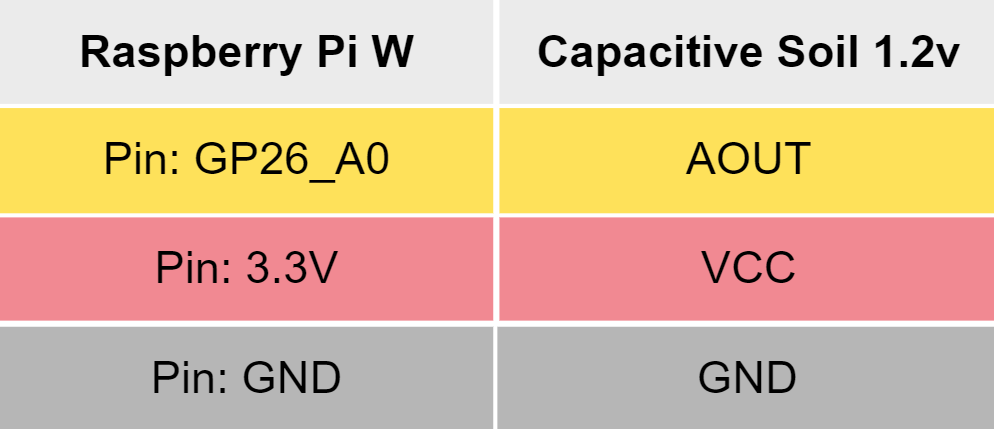

= 🌵 CAPACITIVE-SOIL-PICO 🌵
Stevan Vlajic
1.0.0, {docdate}: My-Projects
//:toc-placement!:  // prevents the generation of the doc at this position, so it can be printed afterwards
:sourcedir: ../src/main/java
:icons: font
:sectnums:    // Nummerierung der Überschriften / section numbering
:toc: left
:experimental:

== COMPONENTS 🦴

=== RASPBERRY PI PICO W

image:../img/bootsel.png[]

:tip-caption: pass:[💸]
[TIP]
https://www.raspberrypi.com/products/raspberry-pi-pico/[RASPBERRY PI PICO W] | GET IT

=== CAPACATIVE-SOIL-SENSOR 1.2V
image:../img/soil.png[]

:tip-caption: pass:[💸]
[TIP]
https://www.amazon.com/Gikfun-Capacitive-Corrosion-Resistant-Detection/dp/B07H3P1NRM[CAPACATIVE SOIL] | GET IT

=== MICRO-PYTHON 🐍

image:../img/micro-python.png[300, 200]

:tip-caption: pass:[💸]
[TIP]
https://www.raspberrypi.com/documentation/microcontrollers/raspberry-pi-pico.html[MICRO PYTHON] | GET IT

== SETUP 🤖 

=== PINOUT 

=== CONNECTED PINS

image:./img/pinned.jpg[]

=== WHAT TO DO

* Connect you Raspberry-Pi-Pico-W to your PC 
* Drag and drop and drop your the micro-python-image on the pico
* Open the Thonny editor 
* Create a main.py file (main.py runs automatically after plugging it in)
* Create a calibrator.py file
* Paste the my calibrator-code into the calibrator.py file on your pico
* Run twice -> Wait -> Copy the values 
below
** First run: dry-value output
** Second run: wet-value outpu
* Assign:
** dry_value = `CRTL + V(dry)`
** wet_value = `CTRL + V(wet)`
 
== CODE ⚗️

[source, python]
----

# import required modules
from machine import ADC, Pin
import utime

# use variables instead of numbers:
soil = ADC(Pin(26)) # Soil moisture PIN reference

#Calibraton values
min_moisture=0
max_moisture=65535

readDelay = 0.5 # delay between readings

while True:
    # read moisture value and convert to percentage into the calibration range
    moisture = (max_moisture-soil.read_u16())*100/(max_moisture-min_moisture) 
    # print values
    print("moisture: " + "%.2f" % moisture +"% (adc: "+str(soil.read_u16())+")")
    utime.sleep(readDelay) # set a delay between readings
    
----

== MATH 🧮

* Formular for calculating: `(perc_diff = (max-x) *100)/(max-min)`

Here is what each variable represents:

* max: the maximum value that x can take
* min: the minimum value that x can take
* x: the current value that we want to calculate the percentage for

The formula calculates the percentage by first subtracting the current value x from the maximum value max, and then dividing the result by the range between max and min (i.e., max-min). Finally, it multiplies the result by 100 to get the percentage value.

In summary, the formula calculates the percentage difference between the current value x and the maximum value max, relative to the range between max and min.

APPLIED:

* Formular in the code: `moisture = (max_moisture-soil.read_u16())*100/(max_moisture-min_moisture)`

Here is what each variable represents:

* moisture: the moist of the ground in percent in relation to the min and max values
* max_moisture: max range of the soil_read_u16()
* min_moisture: min range of the soil_read_u16()
* soil.read_u16() [x]: 16-bit integer value representing current the analog voltage level of the pin

== Headline 5

== Headline 6
